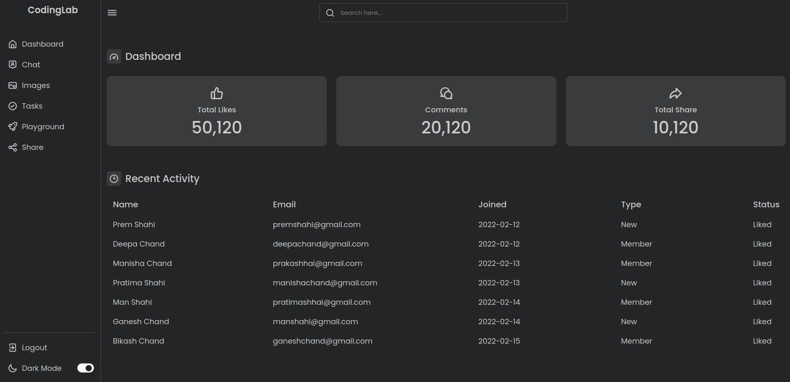

# Vite Starter - Admin Panel Dashboard

This project is a basic starter template using **Vite** to create a modern, responsive Admin Panel Dashboard. The dashboard includes essential components to visualize user engagement metrics and recent activity.



## Project Structure

This project is organized to provide a simple structure for building a front-end application with Vite. Key files include:

```
├── public/
│   ├── counter.js      # Logic for counting metrics
│   ├── index.html      # Entry point HTML file
│   ├── main.js         # Main JavaScript file to initialize the app
│   ├── style.css       # Core styling for the dashboard
│   └── assets/
│       └── javascript.svg   # Example SVG asset used in the app
├── package.json        # Project dependencies and scripts
├── package-lock.json   # Lockfile for exact dependency versions
└── README.md           # Project documentation
```

## Features

- **Vite-Driven Development**: Utilizes Vite as a fast and modern development environment.
- **Dashboard UI**: Includes basic UI elements like total likes, comments, and shares for user engagement statistics.
- **Recent Activity Table**: Displays recent user activity with details such as name, email, join date, and status.
- **Dark Mode Toggle**: Switch between dark and light modes for a customizable viewing experience.

## Getting Started

### Prerequisites

Ensure you have Node.js and npm installed.

### Installation

1. **Clone the repository**:

   ```bash
   git clone https://github.com/your-username/vite-starter-admin-panel.git
   cd vite-starter-admin-panel
   ```

2. **Install dependencies**:

   ```bash
   npm install
   ```

### Scripts

This project includes the following npm scripts:

- **Development Server**: Start a local development server with Vite.

  ```bash
  npm run dev
  ```

  The app will be available at `http://localhost:5173`.

- **Build**: Create a production-ready build.

  ```bash
  npm run build
  ```

- **Preview**: Preview the production build locally.

  ```bash
  npm run preview
  ```

## Vite Configuration

This project uses **Vite v5.4.2**. Vite is chosen for its simplicity and speed in front-end development. By default, the app runs in module mode (`"type": "module"`), which is compatible with modern JavaScript syntax.

The minimal Vite configuration allows for:

- **Hot Module Replacement (HMR)**: Changes in the code update instantly in the browser.
- **Fast Builds**: Optimized production builds and quick reloads.

## Dependencies

The main dependency is:

- **vite**: ^5.4.2 - Provides a fast and lean development server with built-in optimizations.

## Customization

To modify the dashboard, make changes in the `public/` directory:

- **HTML (`index.html`)**: Update the structure of the page, add meta tags, or include additional libraries if needed.
- **CSS (`style.css`)**: Customize styling to match your brand or theme.
- **JavaScript (`main.js`, `counter.js`)**: Extend functionality by adding more interactivity, data handling, or integrating with an API.

## Potential Enhancements

This project serves as a basic template and can be expanded by adding:

- **Backend API Integration**: Fetch dynamic data for real-time user metrics and activity logs.
- **Authentication**: Set up login and permissions to control access to the dashboard.
- **Analytics and Visualizations**: Add charts and graphs to make data more visually informative.
- **Notification System**: Notify administrators about new activities or important events.

## License

This project is open-source under the MIT license. Feel free to use, modify, and distribute.

---

This `README.md` file includes an embedded image. Ensure `capture.jpg` is in the root folder or update the path if you place it elsewhere, such as `./images/capture.jpg`.
